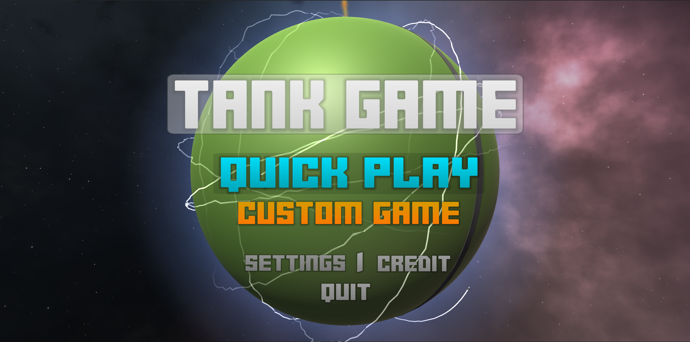
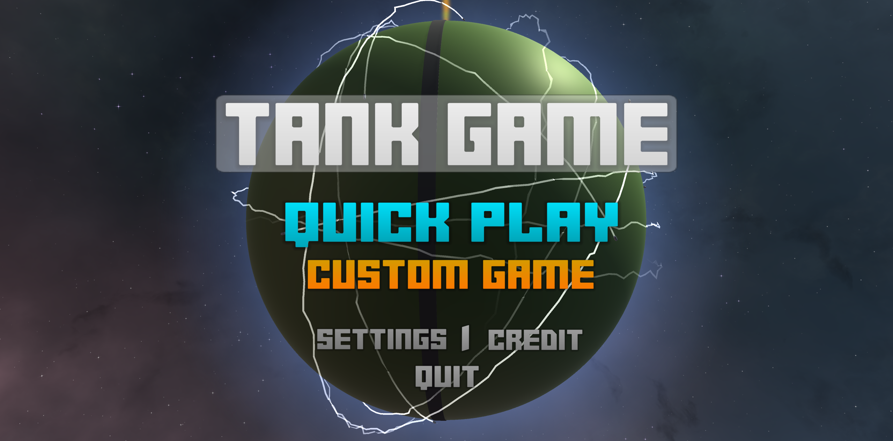
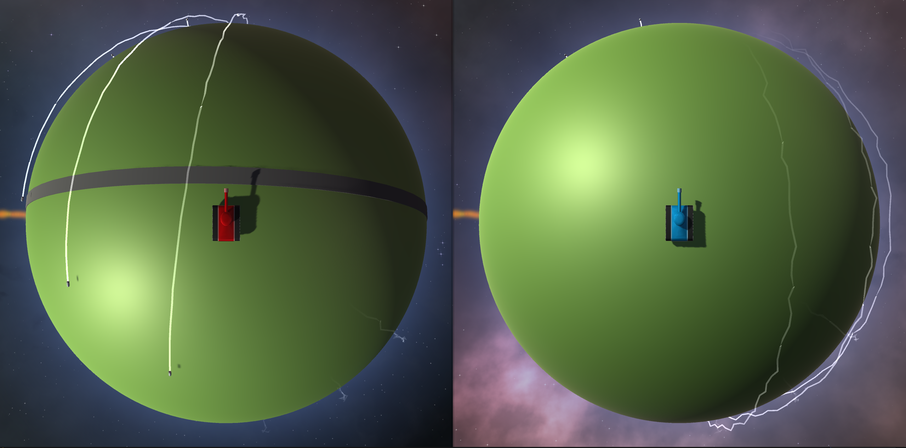
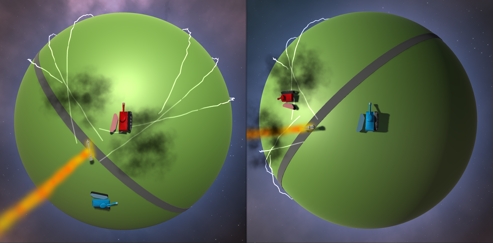
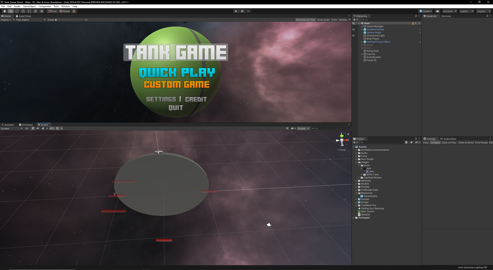
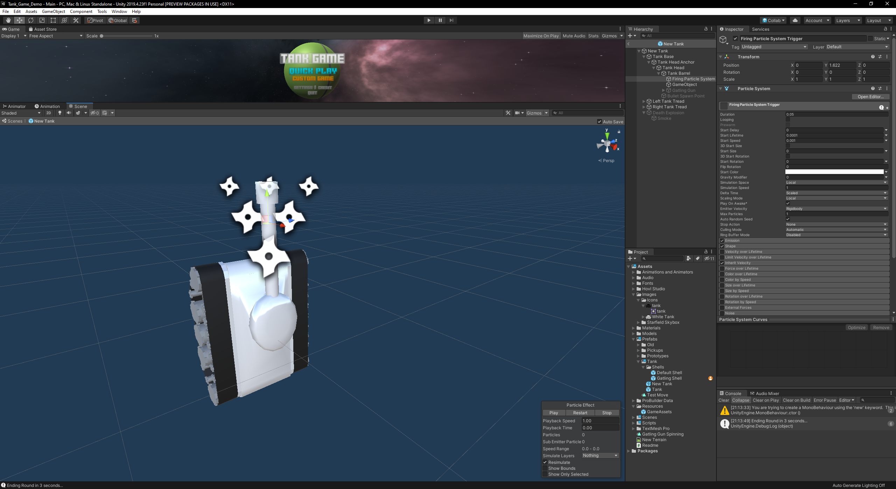

# The Tank Game

NOTE:
What is attached to github is scripts that I have coded that are apart of the tank game, these scripts will not work without the unity project file.
To download the unity project, visit my google drive: 
https://drive.google.com/drive/folders/1LIc0m_dpX3KdigDawqXN-1pLPt1E4rvJ?usp=sharing

PROTOTYPE WARNING:
While close to a working game, I have yet added multiplayer functionality to it, making it impossible to play with others at the moment. This prototype is simply to show my personal hobby of video game development.

To Do List:
- Add more pick up items.
- Create multiplayer functionality.
- spruce up graphics.
- fix physics issues. 

# Main Menu

# Gameplay

# Editor

